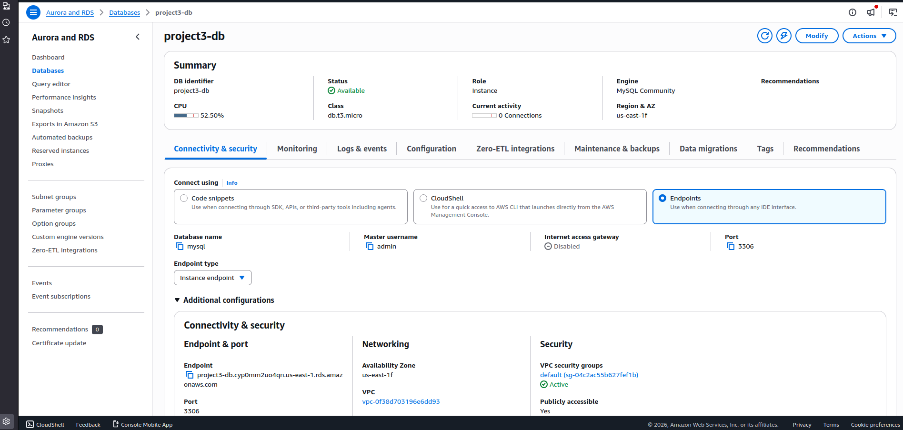
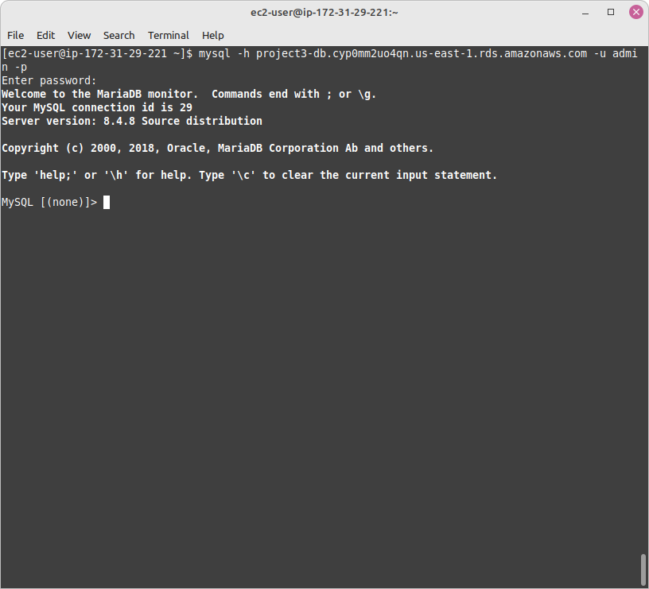
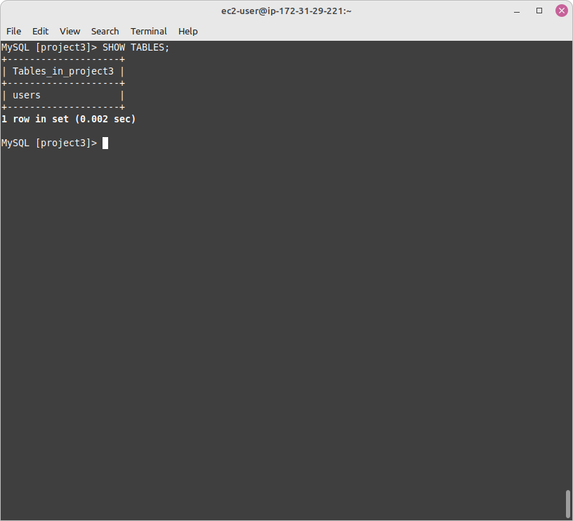
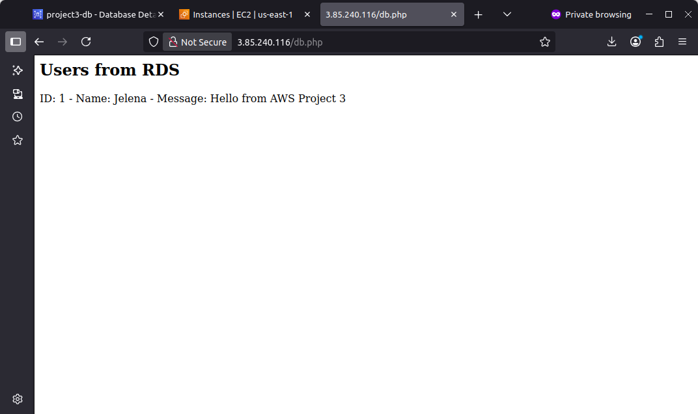
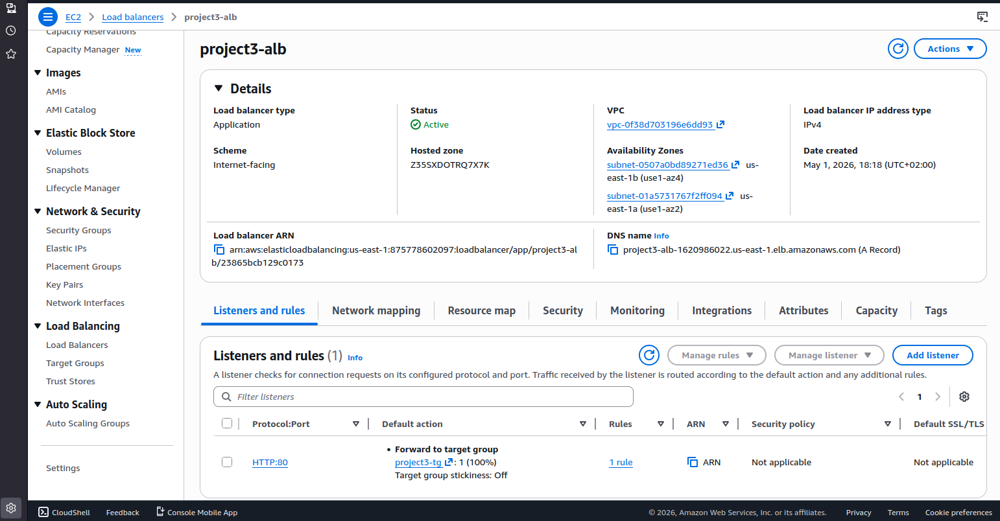
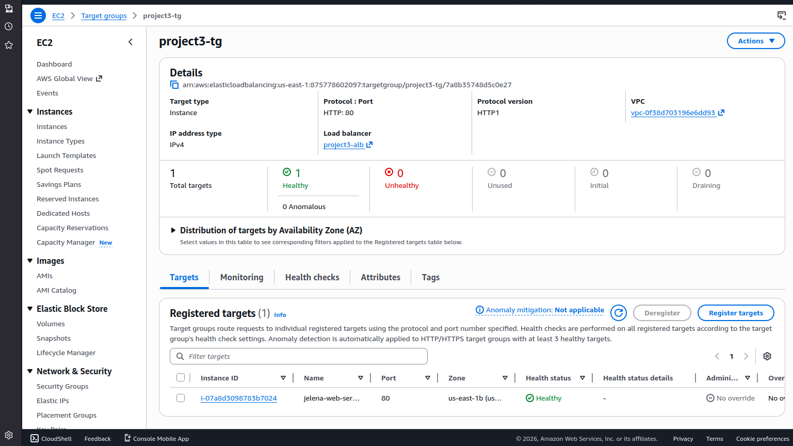
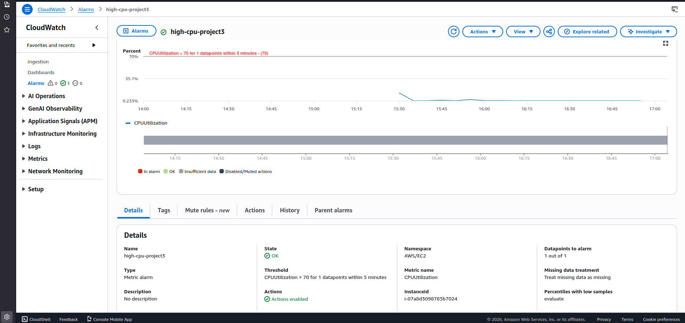

# AWS Web Application Architecture Project

## Overview
This project demonstrates a multi-tier cloud architecture using AWS services. It includes a web server, database, load balancing, and monitoring components.

---

## Architecture Components
- EC2 (Amazon Linux, NGINX, PHP)
- RDS (MySQL)
- Application Load Balancer
- CloudWatch (monitoring and alarms)

---

## Architecture Flow
User → Load Balancer → EC2 Web Server → RDS Database

---

## Features
- Dynamic web application connected to RDS
- Secure communication between EC2 and database
- Load-balanced traffic handling
- CloudWatch alarm for CPU monitoring

---

## Implementation Steps

### 1. EC2 Setup
- Deployed Linux server
- Installed NGINX and PHP

### 2. RDS Setup
- Created MySQL database instance
- Configured connectivity and security groups

### 3. Database Integration
- Connected EC2 to RDS
- Created database and tables
- Inserted and queried data

### 4. Web Application
- Built simple PHP page to display database data

### 5. Load Balancer
- Created Application Load Balancer
- Configured target group and health checks

### 6. Monitoring
- Configured CloudWatch alarm for CPU utilization

---

## Screenshots

### RDS Instance

### Database Connection

### Table Data

### Web App Output

### Load Balancer

### Target Group

### CloudWatch Alarm

---

## Key Skills Demonstrated
- Cloud architecture design
- EC2 and Linux server management
- Database integration (RDS)
- Load balancing concepts
- Monitoring and alerting
- AWS security best practices (IAM, Security Groups)

---

## Author
Jelena
